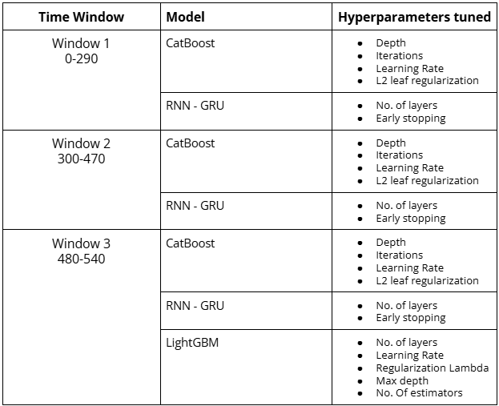
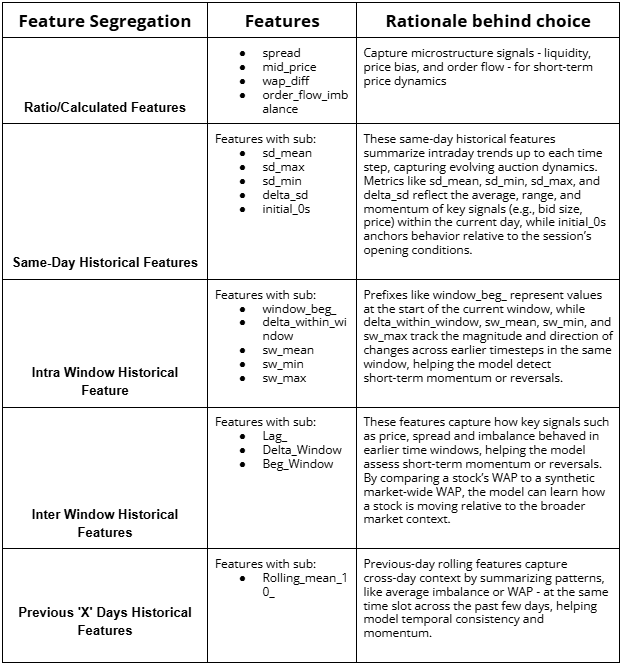

# Optiver Trading at the Close – Time Series Modeling

This project was developed as part of the [Optiver "Trading at the Close" Kaggle competition](https://www.kaggle.com/competitions/optiver-trading-at-the-close/overview). The challenge involves predicting short-term price movements (in basis points) of hundreds of NASDAQ-listed stocks during the volatile last 10 minutes of trading using auction and order book data.

---

## Problem Overview

Every trading day, the **Nasdaq Closing Cross auction** determines the official closing price of securities. This price is critical for both retail and institutional trading decisions. Market makers like **Optiver** combine order book and auction data to determine supply-demand imbalances and pricing.

**Goal**: Predict the 60-second future price move of a stock relative to a synthetic index using historic auction + order book data.

- **Evaluation Metric**: Mean Absolute Error (MAE)
- **API Restriction**: Models must avoid data leakage and respect temporal order

---

## Modeling Strategy

###  Time-Aware Windowing

The dataset was split into 3 **non-overlapping time windows**:
- **Window 1**: 0–290 seconds
- **Window 2**: 300–470 seconds
- **Window 3**: 480–540 seconds

Each window simulates a separate short-term market condition and allows for focused model tuning.

---

### Cross-Validation Approach

We used **time-based cross-validation**, ensuring that:
- **Training data precedes validation data** chronologically (no random shuffling)
- Mimics real-world forecasting where only past data is available at prediction time
- Prevents leakage and preserves causal structure of stock movement

---

### Models Evaluated

Across all windows, we compared the performance of:
- **CatBoost**
- **RNN-GRU**
- **LightGBM**
- **Transformer-based model** (experimental)

Models were tuned using grid/randomized search over key hyperparameters like depth, learning rate, number of layers, regularization, and early stopping.

---

### Feature Engineering

We engineered ~220 domain-informed features per record, including:

- **Ratio/Calculated Features** (e.g., spread, mid-price, order flow imbalance)
- **Same-Day Historical Features** (e.g., sd_mean, delta_sd, initial_0s)
- **Intra-Window Trends** (e.g., sw_mean, delta_within_window)
- **Inter-Window Trends** (e.g., lagged WAP, cross-day indicators)
- **Previous Days’ Rolling Statistics** (e.g., rolling mean of imbalance)

---

### Model Performance Summary

| Time Window | Model      | Validation MAE |
|-------------|------------|----------------|
| 0–290s      | CatBoost   | 6.11           |
|             | RNN - GRU  | 6.32           |
| 300–470s    | CatBoost   | 5.22           |
|             | RNN - GRU  | 5.23           |
| 480–540s    | CatBoost   | 4.98           |
|             | RNN - GRU  | 4.99           |
|             | LightGBM   | 5.00           |

---

### Additional Exploration

- Implemented a **Transformer architecture**
- Models showed marginally better results during the final window (most volatile and data-rich)
- Ensemble experimentation was considered but deprioritized for interpretability
